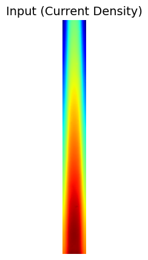
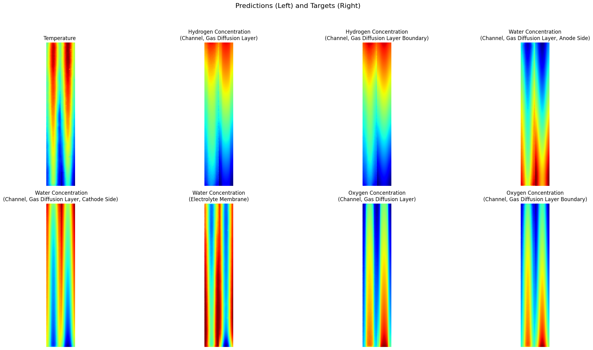

# MultiOutDiffuser

## Project Overview

    

    

This project aims to predict multiple target images from a single input image.  
Specifically, in the context of fuel cell applications, the project uses a current density distribution map as the input to predict a total of 8 target physical field distribution maps. These targets include:

1. **Temperature Distribution Map (Temperature)**  
2. **Hydrogen Concentration Distribution Map** (Channels and Gas Diffusion Layers)  
3. **Hydrogen Concentration Distribution Map** (Channels and Gas Diffusion Layer Boundaries)  
4. **Water Concentration Distribution Map** (Channels, Gas Diffusion Layers, and Anode Side)  
5. **Water Concentration Distribution Map** (Channels, Gas Diffusion Layers, and Cathode Side)  
6. **Water Concentration Distribution Map** (Electrolyte Membrane)  
7. **Oxygen Concentration Distribution Map** (Channels and Gas Diffusion Layers)  
8. **Oxygen Concentration Distribution Map** (Channels and Gas Diffusion Layer Boundaries)